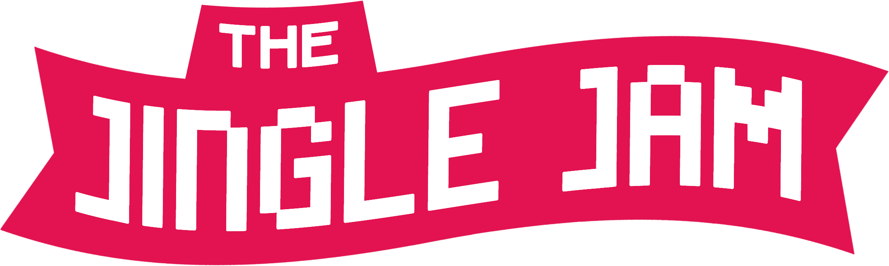

<div align="center">



# Jingle Jam Tracker

**The live fundraising tracker and public API behind the [Jingle Jam](https://www.jinglejam.co.uk/tracker).**

[](https://github.com/JingleJam/JingleJamTracker/actions/workflows/ci.yml)


[**API**](docs/API.md) · [**Web Pages**](docs/WEB-PAGES.md) · [**Architecture**](docs/ARCHITECTURE.md) · [**Local Development**](docs/LOCAL-DEVELOPMENT.md)

</div>

<br>


## What is this?

The Jingle Jam is an annual charity fundraiser, run on [Tiltify](https://tiltify.com) through the first two weeks of December. This repository has two parts:

- **A public JSON API** with the event total, per-cause totals, every fundraising campaign, and a graph of the total over time. Anyone can use it, free, with no API key.
- **The tracker web pages** built on that API: the main tracker embedded on jinglejam.co.uk, a tracker for each cause, campaign and team event, a home page with search, and a full-screen TV view for streams and venues.

## Using the API

The API is open to everyone. It needs no key and no sign-up, and CORS is enabled, so it can be called directly from a browser.

```bash
curl https://dashboard.jinglejam.co.uk/api/v1/event
```

```js
const res = await fetch('https://dashboard.jinglejam.co.uk/api/v1/event');
const data = await res.json();

console.log(`£${data.raised.toLocaleString()} raised from ${data.donations.toLocaleString()} donations`);
```

| Endpoint | Returns |
|---|---|
| [`GET /api/v1/event`](docs/API.md#get-apiv1event) | Event totals, per-cause totals, yearly history and the top 25 campaigns |
| [`GET /api/v1/campaigns`](docs/API.md#get-apiv1campaigns) | Every campaign and team event, paginated, searchable and filterable by type and cause |
| [`GET /api/v1/campaigns/{id}`](docs/API.md#get-apiv1campaignsid) | One campaign or team event, with live social links, donation matches, rewards and top donors (and, for a team event, its campaigns) |
| [`GET /api/v1/causes`](docs/API.md#get-apiv1causes) | Every cause and its total |
| [`GET /api/v1/causes/{cause}`](docs/API.md#get-apiv1causescause) | One cause's total and its top campaigns |
| [`GET /api/v1/timeline`](docs/API.md#get-apiv1timeline) | This year's total over time, one point every 10 minutes |
| [`GET /api/v1/timeline/history`](docs/API.md#get-apiv1timelinehistory) | Previous years' totals over time (2016 onwards) |

**Base URL:** `https://dashboard.jinglejam.co.uk`

The 2025 endpoints (`/api/tiltify`, `/api/campaigns` and `/api/graph/*`) keep working until the 2027 event. See [Legacy endpoints](docs/API.md#legacy-endpoints).

📖 See the **[API reference](docs/API.md)** for every field, error and example, or load the [OpenAPI spec](website/openapi.yaml) (served at `/openapi.yaml`) into your tools.

### Usage guidelines

The API is free to use. To keep it fast for everyone, please follow these guidelines:

1. **Make at most 1 request per second**, counted across all of your users combined, not per user.
2. **Don't poll faster than every 10 seconds.** The data only refreshes every 10 seconds during the event (and less often outside it), so faster polling returns the same response. Every response except the two timelines has a `meta.updatedAt` field saying when it was last refreshed, so you can schedule your next request for about 15 seconds after that time.
3. **Put a cache in front of the API if you have many users.** If your app, bot or overlay is used by lots of people, fetch from your own server and serve those users from your cache, instead of having every client call the API directly.
4. **Expect a quiet off-season.** Outside December, totals are zero or carry over from the last event, and `meta.event.startsAt` / `meta.event.endsAt` show when the next one begins.

## The web pages

| Page | URL |
|---|---|
| Home | [`/home`](https://dashboard.jinglejam.co.uk/home): search for causes, campaigns and team events, and links to every page and cause |
| Main tracker | [`/tracker`](https://dashboard.jinglejam.co.uk/tracker) |
| Whole-event tracker | [`/jingle-jam`](https://dashboard.jinglejam.co.uk/jingle-jam) |
| Cause tracker | [`/causes/{cause}`](https://dashboard.jinglejam.co.uk/causes/calm), e.g. `/causes/calm` |
| Campaign and team event tracker | `/campaigns/{id}` |
| TV view | [`/tv?type={cause or campaign}&id={id}`](https://dashboard.jinglejam.co.uk/tv), e.g. `/tv?type=cause&id=calm` |

🖥️ See **[Web Pages](docs/WEB-PAGES.md)** for a tour of each page and its options.

## Documentation

| Document | For |
|---|---|
| 📖 [API](docs/API.md) | Developers using the API: endpoints, fields, errors |
| 🖥️ [Web Pages](docs/WEB-PAGES.md) | Everyone: what each page shows, URL options, TV mode |
| 🏗️ [Architecture](docs/ARCHITECTURE.md) | Contributors: how data gets from Tiltify to the page, storage, freshness, deployment |
| 🛠️ [Local Development](docs/LOCAL-DEVELOPMENT.md) | Contributors: setup, scripts, local data, debugging, admin endpoints |
| 🧩 [Tiltify Data Model](docs/TILTIFY.md) | Contributors: how Tiltify stores the event, charities and campaigns |

## Contributing

Quick start (Node.js 22+):

```bash
npm install
cp workers/tiltify-cache/.dev.vars.example workers/tiltify-cache/.dev.vars
npm run dev
```

Then open http://127.0.0.1:8788/tracker. See [Local Development](docs/LOCAL-DEVELOPMENT.md) for everything else.

Work happens on `develop`, which deploys to the [development environment](https://develop.jingle-jam-tracker.pages.dev/tracker). Merging to `master` deploys to production.

<div align="center">
<br>
<sub>Donations go to the causes, not to this project. <a href="https://www.jinglejam.co.uk">jinglejam.co.uk</a></sub>
</div>
