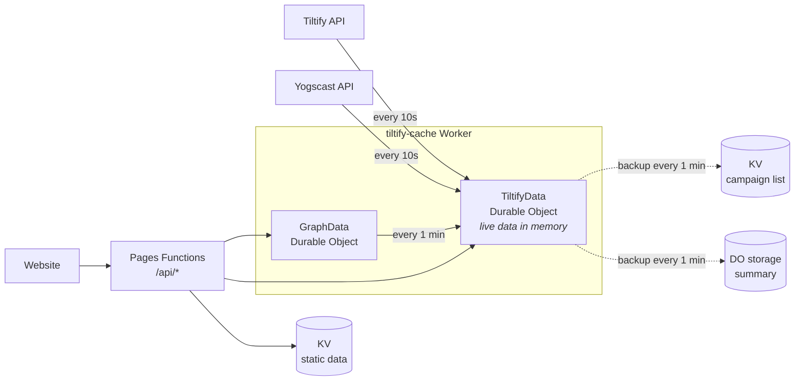

# Architecture

Jingle Jam Tracker shows live fundraising totals for the Jingle Jam. It polls Tiltify every 10 seconds, keeps the latest data in memory, and serves it to the website.

## Components

| Component | Location | Job |
|---|---|---|
| Website | [website/](../website/) | Static pages that call `/api/*` and animate the totals. |
| Pages Functions | [functions/api/](../functions/api/) | Thin proxy. Each API call is forwarded to one Durable Object (or reads static data from KV). |
| `TiltifyData` Durable Object | [workers/tiltify-cache/src/do/tiltifyData.ts](../workers/tiltify-cache/src/do/tiltifyData.ts) | Fetches from Tiltify and Yogscast, holds the live data in memory, serves `/api/tiltify` and `/api/campaigns`. |
| `GraphData` Durable Object | [workers/tiltify-cache/src/do/graphData.ts](../workers/tiltify-cache/src/do/graphData.ts) | Reads the latest totals from `TiltifyData` every minute and records a graph point every 10 minutes. Serves `/api/graph/current`. |
| KV (`JINGLE_JAM_DATA`) | [kv/](../kv/) | Static data uploaded by hand (causes, history, previous years' graph) plus the campaign list backup. |

## How data flows

### 1. Refresh (every 10 seconds)

1. An alarm fires in `TiltifyData`.
2. It fetches the event total, rewards, every campaign and the Yogscast donation count, and combines them into one response.
3. The result replaces what is in memory: the summary (totals, causes, top 100 campaigns) and the full sorted campaign list.

Tiltify returns each campaign's details (name, description, etc.) and amount raised together, so everything is refreshed at once.

### 2. API request

1. The website calls `/api/tiltify` or `/api/campaigns`.
2. The Pages Function forwards the request to `TiltifyData`.
3. `TiltifyData` answers from memory. No storage is read.

One API call = one Durable Object request.

### 3. Backups

A Durable Object has a single instance that handles every request, so values kept in its instance variables are shared between requests ([Cloudflare: in-memory state](https://developers.cloudflare.com/durable-objects/reference/in-memory-state/)). That memory is lost when the object restarts: on deploys, after 10 seconds idle (hibernation) or 70–140 seconds idle (eviction), or when Cloudflare moves it ([lifecycle](https://developers.cloudflare.com/durable-objects/concepts/durable-object-lifecycle/)). During the event, the 10 second alarm and constant viewer traffic keep it awake. Backups exist only so there is something to serve straight after a restart.

| Backup | Where | How often |
|---|---|---|
| Full campaign list | KV key `campaigns-{YEAR}` | At most every 1 minute, only if changed |
| Summary (totals + top 100) | Durable Object storage | At most every 1 minute, only if changed |

After a restart, the backups are served until the next refresh (10 seconds or less during the event) replaces them with live data.

## How fresh is the data?

| Data | Freshness |
|---|---|
| Totals, donation count, collections, cause totals | 10–15 seconds |
| Campaign amounts raised and campaign details | 10–15 seconds |
| Right after a restart | Up to ~1 minute, until the next refresh |
| Graph | One point every 10 minutes (`GRAPH_REFRESH_TIME`) |
| Causes, history, previous years | Whenever someone uploads new KV data |

"10–15 seconds" is our 10 second poll plus Tiltify's own update delay.

## Refresh schedule

| Period | Refresh interval |
|---|---|
| From 1 day before the event to 1 day after it | Every 10 seconds (`LIVE_REFRESH_TIME`) |
| Rest of the year | Every 5 minutes (`IDLE_REFRESH_TIME`) |

Refreshing is switched on with `ENABLE_REFRESH` in [wrangler.toml](../workers/tiltify-cache/wrangler.toml). Interval constants live in [constants.ts](../workers/tiltify-cache/src/constants.ts).

## Where each piece of data lives

| Data | Source | Stored in |
|---|---|---|
| Totals, collections, campaigns | Tiltify | Durable Object memory (backed up to KV / DO storage) |
| Donation count | Yogscast API | Durable Object memory |
| Causes (names, logos, colours) | Uploaded by hand | KV key `causes` |
| Yearly history | Uploaded by hand | KV key `summary` |
| Previous years' graph | Uploaded by hand | KV key `trends-previous` |
| Current graph | Built by `GraphData` | `GraphData` storage |

## Why it is built this way

Durable Object storage is billed per 4 KB written. The campaign list is several megabytes, so writing it every 10 seconds cost hundreds of dollars a month. Keeping live data in memory makes requests free of storage costs, and KV (billed per write, not per byte) holds the one large backup cheaply.

| Per 10 second refresh | Durable Object storage | KV |
|---|---|---|
| Reads | 0 | 2 (`causes` and `summary`) |
| Writes | ~0 (only the alarm, plus a backup at most every 1 min) | ~0 (a backup at most every 1 min) |
