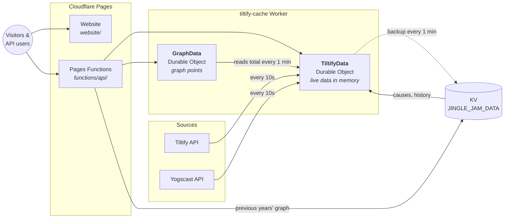

# 🏗️ Architecture

[← Back to README](../README.md) · [API](API.md) · [Web Pages](WEB-PAGES.md) · [Local Development](LOCAL-DEVELOPMENT.md)

The tracker runs entirely on Cloudflare. A Durable Object polls Tiltify every 10 seconds and keeps the latest data in memory. The API endpoints are thin Pages Functions that forward each request to it.



## Components

| Component | Code | Role |
|---|---|---|
| **Website** | [website/](../website/) | Static pages that call `/api/*` and animate the totals: loaders in `pages/`, HTML fragments in `fragments/`, scripts in `js/` and the stylesheet in `css/`. [`_redirects`](../website/_redirects) maps each page URL to its loader. See [Web Pages](WEB-PAGES.md). |
| **Pages Functions** | [functions/api/](../functions/api/) | One file per endpoint, with the current ones under `v1/`. Each forwards the request to a Durable Object (or reads KV) and adds CORS headers and JSON errors ([handler.ts](../functions/api/handler.ts)). The 2025 paths `/api/tiltify` and `/api/campaigns` still serve their 2025 response shapes, and `/api/graph/current` and `/api/graph/previous` answer with a `308` redirect to `/api/v1/timeline` and `/api/v1/timeline/history`, until the 2027 event ([legacy endpoints](API.md#legacy-endpoints)). Any other `/api/*` path gets a JSON `404` from [`[[path]].ts`](../functions/api/%5B%5Bpath%5D%5D.ts). [`_routes.json`](../_routes.json) sends only `/api/*` to Functions. |
| **`TiltifyData`** Durable Object | [tiltifyData.ts](../workers/tiltify-cache/src/do/tiltifyData.ts) | Fetches from Tiltify and Yogscast, holds the live data in memory, and serves every `/api/*` endpoint except the timelines. Single campaigns and team events add live data fetched from Tiltify on request ([factDetails.ts](../workers/tiltify-cache/src/services/factDetails.ts)). |
| **`GraphData`** Durable Object | [graphData.ts](../workers/tiltify-cache/src/do/graphData.ts) | Reads the total from `TiltifyData`'s `/api/v1/event` every minute, records a point every 10 minutes, and serves `/api/v1/timeline`. |
| **Data fetching** | [api.ts](../workers/tiltify-cache/src/api.ts), [dependencies/](../workers/tiltify-cache/src/dependencies/) | Calls Tiltify and Yogscast and builds the summary, which `TiltifyData` keeps in an internal format. `TiltifyData` gets it through a data source ([dataSource.ts](../workers/tiltify-cache/src/services/dataSource.ts)). |
| **Demo data** | [demo/](../workers/tiltify-cache/src/demo/) | Replaces Tiltify when `DEMO_MODE` is set: generated campaigns, team events, live data for single fundraisers and the timeline, for an event about to start, under way, or about to end. See [Demo mode](LOCAL-DEVELOPMENT.md#demo-mode). |
| **Response shapes** | [responses.ts](../workers/tiltify-cache/src/responses.ts) | Turns the internal summary into each v1 response (with its [`meta`](API.md#meta) object and [campaign collections](API.md#campaign-collection)) and into the 2025 legacy shapes. |
| **KV** (`JINGLE_JAM_DATA`) | [kv/](../kv/) | Hand-maintained data (causes, yearly history, previous years' graph), plus the campaign list backup. |

The Durable Objects live in a separate Worker, `tiltify-cache` ([workers/tiltify-cache/](../workers/tiltify-cache/)), because Pages projects can't define Durable Objects. The Pages project binds to them by script name in [wrangler.toml](../wrangler.toml).

## How data flows

### 1. Refresh (every 10 seconds)

1. An alarm fires in `TiltifyData`. It schedules the next alarm first, so a failed refresh doesn't stop the loop.
2. It reads `causes` and `summary` (history) from KV.
3. In parallel, it fetches the fundraiser's totals and rewards from Tiltify, the donation count from the Yogscast API, and the `@yogscast` user's lifetime dollar total (used for the conversion rate).
4. It fetches every campaign from Tiltify, 6 pages of 100 at a time.
5. It works out each cause's total, builds the campaign list sorted by amount raised, and replaces what is in memory:
   - the **summary** (totals, causes, history and the top 100 campaigns, in an internal format; [`/api/v1/event`](API.md#get-apiv1event) serves the top 25 of them and the legacy `/api/tiltify` all 100)
   - the **full campaign list** (used by `/api/v1/campaigns`, `/api/v1/campaigns/{id}`, `/api/v1/causes/{cause}` and the legacy `/api/campaigns`)

If a refresh comes back with a total of 0 or no campaigns while the previous data had them, the previous data is kept. A brief Tiltify outage never blanks the tracker.

### 2. API request

1. A visitor's browser, or an API user, calls an endpoint such as `/api/v1/event`, `/api/v1/campaigns` or `/api/v1/causes/{cause}`.
2. The Pages Function forwards the request to `TiltifyData`.
3. `TiltifyData` answers from memory without reading storage, building the response's shape with [responses.ts](../workers/tiltify-cache/src/responses.ts).
4. For `/api/v1/campaigns/{id}` (a campaign or a team event), it first checks the id is in this year's campaign list (so the API can't be used to look up any Tiltify fundraiser), then adds live data from two Tiltify queries: the fundraiser's page data (social links, donation matches, rewards, team member count) and its donor leaderboard. That data is kept in memory for 30 seconds (`FACT_DETAILS_TTL_MS`) and shared between concurrent requests. If Tiltify fails, the last data fetched is kept.

The first request after a cold start also starts the alarm loop if it isn't already running.

### 3. Graph (every minute)

`GraphData` has its own alarm that fires every minute. It reads the current total from `TiltifyData`'s `/api/v1/event`. When the refresh time falls on a multiple of 10 minutes (`GRAPH_REFRESH_TIME`) and is inside the event, it appends a `{ date, p, d }` point to its storage, which `/api/v1/timeline` serves. `/api/v1/timeline/history` doesn't touch a Durable Object; it returns the `trends-previous` KV value.

### 4. Backups

A Durable Object runs as a single instance, so data in its memory is shared by every request ([Cloudflare: in-memory state](https://developers.cloudflare.com/durable-objects/reference/in-memory-state/)). That memory is lost when the object restarts: on deploys, after it goes idle, or when Cloudflare moves it ([lifecycle](https://developers.cloudflare.com/durable-objects/concepts/durable-object-lifecycle/)). During the event, the 10-second alarm and constant traffic keep it running. Backups exist so there is something to serve straight after a restart.

| Backup | Stored in | How often |
|---|---|---|
| Summary (totals and top 100) | Durable Object storage | At most once a minute |
| Full campaign list | KV key `campaigns-{YEAR}` | At most once a minute, and only if it changed |

After a restart the backups are served until the next refresh (at most 10 seconds during the event) replaces them.

## How amounts are calculated

| Figure | Calculation |
|---|---|
| **Total raised** | Tiltify's total for the fundraiser |
| **Cause total** | The sum of campaigns for that cause (for a team event, only the money donated directly to it, since its supporting campaigns are counted separately), **plus** an equal share of campaigns that support all causes (no region, the "All The Charities" region, or a region that isn't one of this year's causes), **plus** an equal share of any money not assigned to a campaign (the fundraiser total minus the sum of all campaigns, mostly donations made directly to the event). See [Tiltify Data Model](TILTIFY.md) for how these objects relate. An optional `override` in `kv/causes.json` moves a fixed amount to one cause from the others. |
| **Donations** | The Yogscast API's donation count. If that gives an average donation of £10 or less (a sign the count is wrong), the collections count is used instead. |
| **Collections** | Tiltify reward quantity minus remaining |
| **Dollar conversion rate** | The `@yogscast` user's dollar total this year (lifetime total minus `DOLLAR_OFFSET`) divided by their pound total. Falls back to `CONVERSION_RATE`. |

## How fresh is the data?

| Data | Freshness |
|---|---|
| Totals, donations, collections, cause totals | 10–15 seconds |
| Campaign amounts and details | 10–15 seconds |
| Social links, donation matches, rewards, top donors, team member count | Up to 30 seconds, fetched when requested |
| Straight after a restart | Up to about 1 minute, until the next refresh |
| Current graph | A point every 10 minutes |
| Causes, history, previous years' graph | Whenever the KV data is deployed |

"10–15 seconds" is our 10-second poll plus Tiltify's own update delay.

## Refresh schedule

| Period | Interval | Setting |
|---|---|---|
| From 1 day before the event to 1 day after it | Every 10 seconds | `LIVE_REFRESH_TIME` |
| The rest of the year | Every 5 minutes | `IDLE_REFRESH_TIME` in [constants.ts](../workers/tiltify-cache/src/constants.ts) |

Refreshing only runs while `ENABLE_REFRESH` (and `ENABLE_GRAPH_REFRESH` for the graph) is on in [workers/tiltify-cache/wrangler.toml](../workers/tiltify-cache/wrangler.toml). They are switched on for the event. When refreshing is off, the API serves whatever it last fetched, fetching once on the first request after a restart.

## Where each piece of data lives

| Data | Source | Stored in |
|---|---|---|
| Totals, collections, campaigns | Tiltify | `TiltifyData` memory (backed up to DO storage and KV) |
| Donation count | Yogscast API | `TiltifyData` memory |
| Causes (names, logos, colours) | [kv/causes.json](../kv/causes.json) | KV key `causes` |
| Yearly history | [kv/summary.json](../kv/summary.json) | KV key `summary` |
| Previous years' graph | [kv/trends-previous.json](../kv/trends-previous.json) | KV key `trends-previous` |
| Current year's graph | Built by `GraphData` | `GraphData` storage |

## Why it is built this way

Durable Object storage is billed per 4 KB written. The campaign list is several megabytes, so writing it every 10 seconds used to cost hundreds of dollars a month. Keeping live data in memory means API requests read no storage at all, and KV (billed per write, not per byte) holds the one large backup cheaply.

| Per 10-second refresh | Durable Object storage | KV |
|---|---|---|
| Reads | 0 | 2 (`causes` and `summary`) |
| Writes | ~0 (the alarm, plus a backup at most once a minute) | ~0 (a backup at most once a minute) |

## Environments and deployment

| Environment | Branch | Website & API | Worker | KV namespace |
|---|---|---|---|---|
| **Production** | `master` | `dashboard.jinglejam.co.uk` | `tiltify-cache` | `9d285e05…` |
| **Development** | `develop` | `develop.jingle-jam-tracker.pages.dev` | `tiltify-cache-development` | `c9634f49…` |

GitHub Actions deploys on every push to either branch:

1. **Type check** (`npm run typecheck`)
2. **Deploy the Pages project** (website and Functions)
3. **Deploy the Worker** (`deploy:production` / `deploy:development`)
4. **Upload the KV data** from [kv/](../kv/): `causes`, `summary` and `trends-previous`

[CI](../.github/workflows/ci.yml) also runs on pull requests to `develop` and `master`. It type checks, runs the unit tests (`npm test`) and does a dry-run build of the Functions and both Worker environments.

| Workflow | Trigger |
|---|---|
| [ci.yml](../.github/workflows/ci.yml) | Push and pull request to `develop` / `master` |
| [deploy-dev.yml](../.github/workflows/deploy-dev.yml) | Push to `develop` |
| [deploy-production.yml](../.github/workflows/deploy-production.yml) | Push to `master` |

Deployment needs the `CLOUDFLARE_API_TOKEN` and `CLOUDFLARE_ACCOUNT_ID` repository secrets. The Worker's `ADMIN_TOKEN` is a Wrangler secret (see [Local Development → Admin token](LOCAL-DEVELOPMENT.md#admin-token)).

## Configuration

Worker variables are set in [workers/tiltify-cache/wrangler.toml](../workers/tiltify-cache/wrangler.toml), separately for each environment.

| Variable | Purpose |
|---|---|
| `YEAR` | Event year. Sets the event dates (1 Dec 17:00 to 15 Dec 08:00 UTC) and the storage keys. |
| `FUNDRAISER_PUBLIC_ID` | Tiltify fundraising event ID for this year |
| `ALL_CHARITIES_REGION_ID` | Tiltify region ID of this year's "All The Charities" option. Campaigns with this region are split evenly across all causes. |
| `YOGSCAST_USERNAME` | Tiltify user used for the dollar conversion rate |
| `DOLLAR_OFFSET` | The Yogscast user's lifetime dollar total before this year, subtracted to get this year's total |
| `CONVERSION_RATE` | Fallback GBP → USD rate |
| `COLLECTIONS_AVAILABLE` | Fallback collections total if Tiltify's rewards can't be read |
| `DONATION_DIFFERENCE` | Donation count adjustment (currently unused) |
| `LIVE_REFRESH_TIME` | Seconds between refreshes during the event (`10`) |
| `ENABLE_REFRESH` | Turns the Tiltify refresh loop on |
| `GRAPH_REFRESH_TIME` | Seconds between graph points (`600`) |
| `ENABLE_GRAPH_REFRESH` | Turns the graph loop on |
| `DEMO_MODE` | Empty to use Tiltify, or `starting`, `running` or `ending` to serve [generated demo data](LOCAL-DEVELOPMENT.md#demo-mode). Leave it empty when deploying. |
| `ADMIN_TOKEN` | *Secret.* Token for the [admin endpoints](API.md#admin-endpoints) |

### Preparing for a new year

1. Update `YEAR`, `FUNDRAISER_PUBLIC_ID`, `ALL_CHARITIES_REGION_ID` and `DOLLAR_OFFSET` for both environments in the Worker's `wrangler.toml`. The "All The Charities" region is new every year, like the charity regions.
2. Update [kv/causes.json](../kv/causes.json) with the new causes (Tiltify region IDs, logos, colours, descriptions).
3. Add last year's final totals to [kv/summary.json](../kv/summary.json), and last year's graph to [kv/trends-previous.json](../kv/trends-previous.json).
4. Turn on `ENABLE_REFRESH` and `ENABLE_GRAPH_REFRESH` before the event starts.

## Repository layout

```
JingleJamTracker/
├── website/                 Static pages (see Web Pages)
│   ├── index.html               Main tracker fragment, served at / (the jinglejam.co.uk embed loads it)
│   ├── pages/                   Loader for each page (/tracker, /home, /tv, /causes/..., ...)
│   ├── fragments/               HTML fragments the loaders fetch
│   ├── js/                      Page scripts and the shared search box
│   ├── css/style.css            Styles for every page
│   └── _redirects               Page URLs → loaders, and /script.js and /style.css for the embed
├── functions/api/           Pages Functions, one per endpoint
│   ├── v1/event.ts              → TiltifyData
│   ├── v1/causes/index.ts       → TiltifyData
│   ├── v1/causes/[cause].ts     → TiltifyData
│   ├── v1/campaigns/index.ts    → TiltifyData
│   ├── v1/campaigns/[campaign].ts → TiltifyData (campaigns and team events)
│   ├── v1/timeline/index.ts     → GraphData
│   ├── v1/timeline/history.ts   → KV
│   ├── tiltify.ts               → TiltifyData (2025 summary shape, until the 2027 event)
│   ├── campaigns/index.ts       → TiltifyData (2025 list shape, until the 2027 event)
│   ├── graph/current.ts         Redirects to /api/v1/timeline (until the 2027 event)
│   ├── graph/previous.ts        Redirects to /api/v1/timeline/history (until the 2027 event)
│   ├── [[path]].ts              JSON 404 for any other /api path
│   └── handler.ts               Shared CORS, JSON error and redirect handling
├── workers/tiltify-cache/   The caching Worker
│   └── src/
│       ├── do/                  TiltifyData and GraphData Durable Objects
│       ├── api.ts               Builds the summary from Tiltify and Yogscast
│       ├── demo/                Generated demo data (DEMO_MODE)
│       ├── responses.ts         Builds the v1 and legacy response shapes from the summary
│       ├── dependencies/        Tiltify and Yogscast API clients
│       ├── services/            Data sources, campaign list backup (KV), live data for single fundraisers
│       ├── types/               Response and upstream API types
│       ├── utils/router.ts      Minimal router with :param and admin auth
│       ├── utils/search.ts      Typo-tolerant campaign search
│       └── constants.ts         Paths, intervals and limits
├── kv/                      Hand-maintained KV data
├── scripts/                 Local dev helpers (seed KV, clean dev registry)
├── docs/                    This documentation
├── wrangler.toml            Pages project config
└── package.json             npm workspaces and dev scripts
```
