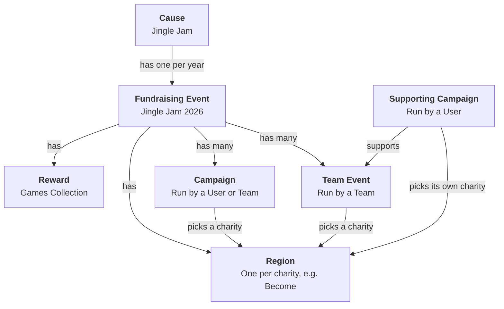

# 🧩 Tiltify Data Model

[← Back to README](../README.md) · [API](API.md) · [Web Pages](WEB-PAGES.md) · [Architecture](ARCHITECTURE.md) · [Local Development](LOCAL-DEVELOPMENT.md)

This page explains how Tiltify, the fundraising platform behind the Jingle Jam, stores and relates all the data in their system. It covers each object the tracker reads from Tiltify and how they link together.

> **You don't need to know any of this to use the API.** The Jingle Jam Tracker API exists to hide Tiltify's data model. It gives you the totals, causes and campaigns as simple JSON. This page is for contributors who work on the code that talks to Tiltify.

Tiltify stores the event as a few linked objects:

## The objects

### Cause

The cause refers to the Jingle Jam itself: the organisation that runs the fundraiser. It is the top level of everything and stays the same from one year to the next. Each year's event hangs off it, so the cause is what ties every year of the Jingle Jam together.

### Fundraising Event

A fundraising event represents a single Jingle Jam year, for example Jingle Jam 2026. A new one is created each year under the cause. It has a start and end date, and everything raised that year belongs to it: every campaign, team event, charity and reward for the year is attached to the event.

The event's total is the headline figure for the year. It includes the money raised by every campaign plus any donations made straight to the event. The tracker is set up to read one event at a time, and it is switched to the new event each year.

### Region

A region is one charity in one year's event, for example Become in Jingle Jam 2026. Tiltify calls them regions, but for the Jingle Jam, each region is a charity. When someone starts a campaign, they choose which charity it raises money for, and Tiltify saves that choice as the campaign's region.

Regions are created fresh for each year's event, so the same charity is a different region every year. The tracker keeps its own list of the year's charities and matches each campaign's region against it to work out how much each charity has raised.

A fundraiser has three choices:

- **One charity**: all its money goes to that charity.
- **All The Charities**: a special region that means "split my money evenly across every charity". Like the charity regions, it is a new region every year.
- **No charity**: the fundraiser has no region at all. The tracker treats this the same as All The Charities.

There are two edge cases. A charity can occasionally have a second region in the same year, and a fundraiser copied from an earlier year can keep that year's old region. The tracker doesn't recognise either region, so it treats them the same as All The Charities and splits the money evenly.

One thing to note is that Regions are relatively hidden from Tiltify's public API.

### Reward

A reward is something donors get for donating. The Jingle Jam has one reward on the event: the Jingle Jam Games Collection, a bundle of games donors receive when they give enough. Tiltify tracks how many collections exist and how many are still left, and the tracker uses those two numbers to show how many have been claimed.

Each year has its own Games Collection with a different set of games, so each year's event gets a new reward. A reward belongs to one event only and is never reused in a later year. The games collection reward is required and automatically added to every campaign and team event.

## Campaign vs. Team Event vs. Supporting Campaign

The first two are fundraising pages that belong to the year's event. Each has its own page, goal, charity and total. The difference is who owns them:

- **Campaign**: a fundraiser owned by one user, for example a streamer raising money on their own channel. A team can also own a campaign. Tiltify calls that a "team campaign", but it is still an ordinary campaign and isn't part of a team event.
- **Team Event**: a fundraiser run by a team, for example a group of creators raising money together. It has its own page, and people can donate directly to it, just like a campaign.

A **Supporting Campaign** is a campaign that sits under a team event. A user starts it to raise money for the team event instead of on its own. It still has its own page and total, but that money is also counted in the team event's total. A team event's total is therefore the money donated directly to the team event plus the money raised by all of its supporting campaigns.

### Choosing a charity

Campaigns, team events and supporting campaigns each pick their own charity. A supporting campaign does **not** have to use its team event's charity. It can pick a different single charity, All The Charities, or no charity, whatever the team event picked.

So the money in a team event can be going to several different charities at once: the team event's own charity for donations made directly to it, and each supporting campaign's charity for the money that campaign raised.

### How the tracker counts them

The tracker gets its list of fundraisers from Tiltify's search, filtered to the year's event. It asks for everything with a status of **published** (still running) or **retired** (finished), which leaves out deleted and unpublished ones.

It filters on status rather than on Tiltify's `public` flag, because the flag behaves differently for team events. A campaign stays public after it is retired, but a team event stops being public as soon as it is retired. Filtering on `public` would make every team event disappear from the list when the event ends.

Each pound is counted once, towards the charity that was picked for it:

- **Campaigns and supporting campaigns** count their whole total towards the charity they picked.
- **Team events** count only the money donated directly to them, towards the team event's charity. Their full total also includes their supporting campaigns, which are already counted on their own.
- **Donations made directly to the fundraising event** don't belong to any fundraiser. They make up the gap between the event total and the sum of all fundraisers, and the tracker splits that gap evenly across every charity.

## User vs. Team

- **User**: a single Tiltify account belonging to one person. Users start campaigns and can join teams.
- **Team**: a group of users under one shared name. A team owns its team events and can also own campaigns. Its members can support its team events with supporting campaigns.

## Querying Tiltify

The tracker reads Tiltify through two of the APIs its website uses:

- **Search** (`api.tiltify.com/search/multi-search`, Meilisearch): the list of fundraisers for the event, filtered by event, status and region. It returns at most 1000 results per query, which is why the tracker splits the search into groups.
- **GraphQL** (`api.tiltify.com`): a single fact's details (the event's totals and rewards, or one campaign's social links, donation matches and rewards) and its donor leaderboard.

The GraphQL API only accepts the queries Tiltify's own website sends. Any other query, even a smaller version of an allowed one, fails with `Client query not allowed`. To read something new, find the request a Tiltify page makes in the browser's network tab and copy its query exactly (whitespace differences are fine). The queries in use are in [dependencies/tiltify.ts](../workers/tiltify-cache/src/dependencies/tiltify.ts), and `npm run test:live` checks they are still accepted.

A few things worth knowing about the GraphQL data:

- **Rewards** on a campaign include the event's own reward (the Games Collection), with `ownerUsageType` `fundraising_event_activation`. A campaign's own rewards have `campaign`, and rewards set up by a team event (`team_event`) also appear on its supporting campaigns.
- **The donor leaderboard** adds up each donor's donations, so it ranks donors, not single donations. The `donations` query, by contrast, lists the most recent donations, not the largest.
- **Supporting campaigns** have `team_event_public_id` set in search results and no `team_public_id`. Team campaigns (owned by a team, not part of a team event) have `team_public_id` set.
