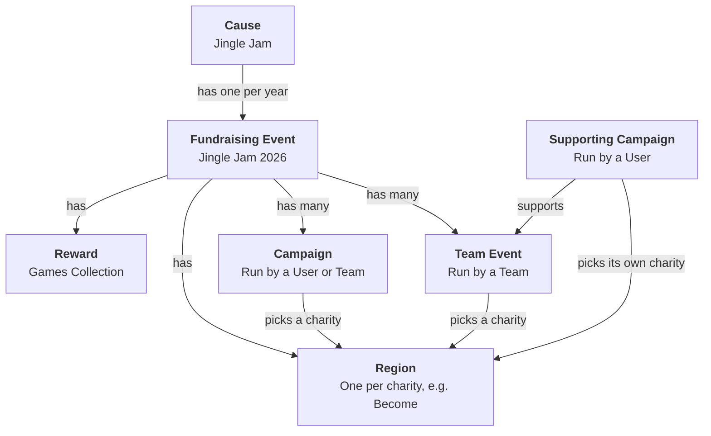

# 🧩 Tiltify Data Model

[← Back to README](../README.md) · [API](API.md) · [Web Pages](WEB-PAGES.md) · [Architecture](ARCHITECTURE.md) · [Local Development](LOCAL-DEVELOPMENT.md)

This page explains how Tiltify, the fundraising platform behind the Jingle Jam, stores and relates all the data in their system. It covers each object the tracker reads from Tiltify and how they link together.

> **You don't need to know any of this to use the API.** The Jingle Jam Tracker API exists to hide Tiltify's data model. It gives you the totals, causes and campaigns as simple JSON. This page is for contributors who work on the code that talks to Tiltify.

Tiltify stores the event as a few linked objects:

## The objects

### Cause

The cause refers to the Jingle Jam itself: the organisation that runs the fundraiser. It is the top level of everything and stays the same from one year to the next. Each year's event hangs off it, so the cause is what ties every year of the Jingle Jam together.

### Fundraising Event

A fundraising event represents a single Jingle Jam year, for example Jingle Jam 2026. A new one is created each year under the cause. It has a start and end date, and everything raised that year belongs to it: every campaign, team event, charity and reward for the year is attached to the event.

The event's total is the headline figure for the year. It includes the money raised by every campaign plus any donations made straight to the event. The tracker is set up to read one event at a time, and it is switched to the new event each year.

### Region

A region is one charity in one year's event, for example Become in Jingle Jam 2026. Tiltify calls them regions, but for the Jingle Jam, each region is a charity. When someone starts a campaign, they choose which charity it raises money for, and Tiltify saves that choice as the campaign's region.

Regions are created fresh for each year's event, so the same charity is a different region every year. The tracker keeps its own list of the year's charities and matches each campaign's region against it to work out how much each charity has raised.

A fundraiser has three choices:

- **One charity**: all its money goes to that charity.
- **All The Charities**: a special region that means "split my money evenly across every charity". Like the charity regions, it is a new region every year.
- **No charity**: the fundraiser has no region at all. The tracker treats this the same as All The Charities.

One thing to note is that Regions are relatively hidden from Tiltify's public API, so you won't find them doucumented in their API documentation.

### Reward

A reward is something donors get for donating. The Jingle Jam has one reward on the event: the Jingle Jam Games Collection, a collection of games donors receive when they give above a certain threshold. Tiltify tracks how many collections exist and how many are still left, and the tracker uses those two numbers to show how many have been claimed.

Each year has its own Games Collection with a different set of games, so each year's event gets a new reward. A reward belongs to one event only and is never reused in a later year. The games collection reward is required and automatically added to every campaign and team event.

## How are Donations handled?

Donations are made either to Campaigns or Team Events. Each has its own page, goal, charity and total. The difference is who owns them:

- **Campaign**: a fundraiser owned by one user, for example a streamer raising money on their own channel. A team can also own a campaign. Tiltify calls that a "team campaign", but it is still an ordinary campaign and isn't part of a team event.
- **Team Event**: a fundraiser run by a team, for example a group of creators raising money together. It has its own page, and people can donate directly to it, just like a campaign.

A **Supporting Campaign** is a campaign that sits under a team event. A user starts it to raise money for the team event instead of on its own. It still has its own page and total, but that money is also counted in the team event's total. A team event's total is therefore the money donated directly to the team event plus the money raised by all of its supporting campaigns.

### Choosing a charity

Campaigns, team events and supporting campaigns each pick their own charity. A supporting campaign does **not** have to use its team event's charity. It can pick a different single charity, All The Charities, or whatever the team event picked.

So the money in a team event can be going to several different charities at once: the team event's own charity for donations made directly to it, and each supporting campaign's charity for the money that campaign raised.

### How the tracker counts them

Each amount is counted once, towards the charity that was picked for it:

- **Campaigns and supporting campaigns** count their whole total towards the charity they picked.
- **Team events** count only the money donated directly to them, towards the team event's charity. Their full total also includes their supporting campaigns, which are already counted on their own.
- **Donations made directly to the fundraising event** don't belong to any fundraiser. They make up the gap between the event total and the sum of all fundraisers, and the tracker splits that gap evenly across every charity. See [Donations to the Fundraising Event](#donations-to-the-fundraising-event).

## Donations to the Fundraising Event

Evet though I stated above that donations come in either through Campaigns or Team Events, they don't have to come in that way. Donations can also be added straight to the fundraising event.

The public can't donate to the event directly, because Tiltify has no donation page for it. These donations are added by the Jingle Jam's managers instead, usually as adjustments to the total or to record donations made outside of Tiltify.

A donation added to the event has no fundraiser and no charity attached, so it only shows up as part of the event's total. The tracker works out how much of this money there is by subtracting the sum of every fundraiser from the event total. It treats that amount the same as All The Charities and splits it evenly across every charity.

### Assigning them to a charity

Sometimes a donation made to the event is meant for a specific charity, or for several charities in set amounts. Tiltify doesn't record this, so it has to be set by hand in [kv/causes.json](../kv/causes.json) using each cause's `override` field.

`override` is the amount, in pounds, of the event's direct donations that belongs to that charity. The tracker adds the override to that charity, then takes an equal share of it back from every charity, including that one. This moves the money out of the even split and into that charity, so the event total stays the same.

For example, with 8 charities, a manager adds £8,000 to the event for Become. By default, the tracker splits it evenly and gives each charity £1,000. Setting `"override": 8000` on Become adds £8,000 to Become and takes £1,000 back from each of the 8 charities. Become ends up with the full £8,000 and the other charities get nothing from that donation.

## User vs. Team

- **User**: a single Tiltify account belonging to one person. Users start campaigns and can join teams.
- **Team**: a group of users under one shared name. A team owns its team events and can also own campaigns. Its members can support its team events with supporting campaigns.
