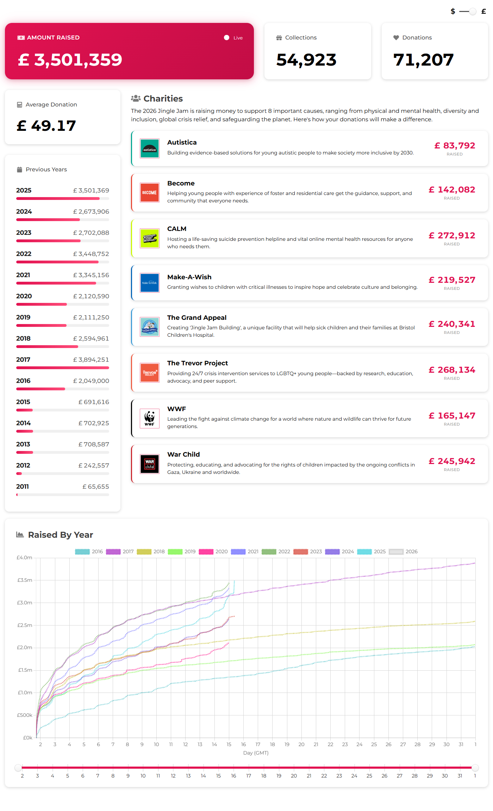
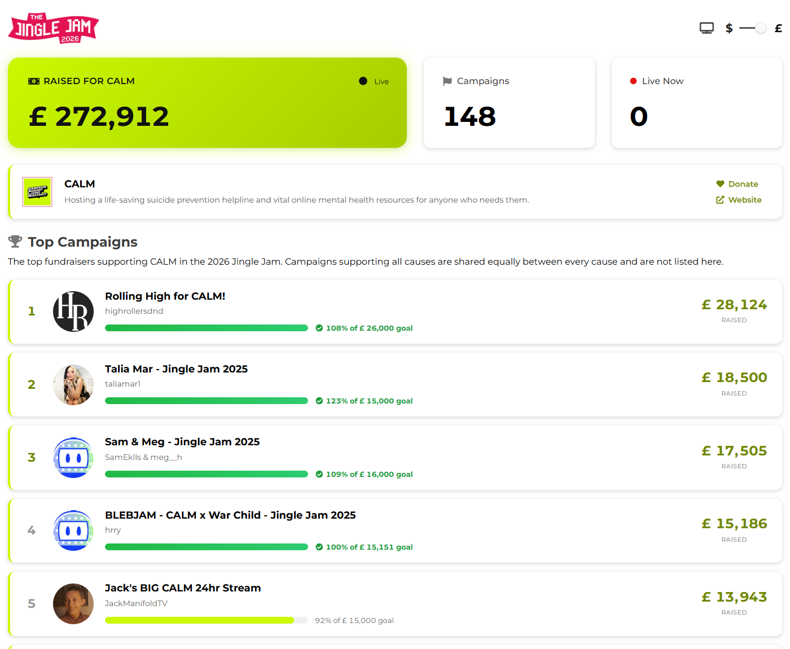
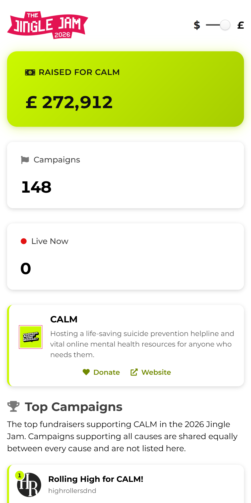
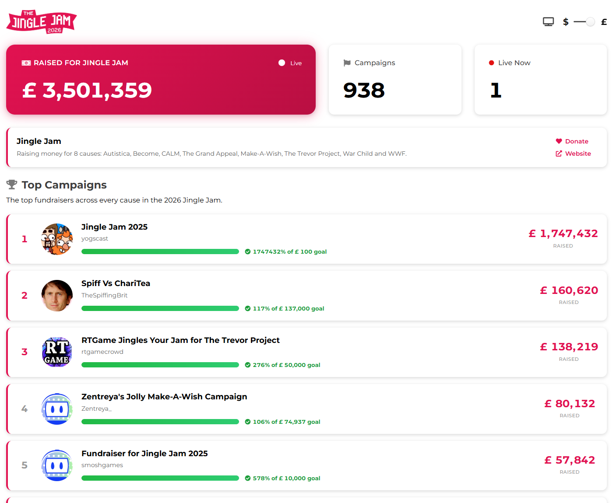
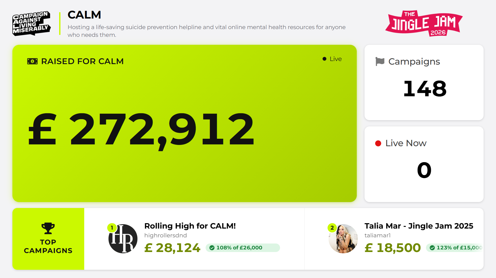

# 🖥️ Web Pages

[← Back to README](../README.md) · [API](API.md) · [Architecture](ARCHITECTURE.md) · [Local Development](LOCAL-DEVELOPMENT.md)

The tracker pages are static HTML and jQuery in [website/](../website/). They call the [public API](API.md), animate the totals as they change, and update themselves every 10–15 seconds while the event is live.

| Page | URL | Data from |
|---|---|---|
| [Main tracker](#main-tracker) | [`/tracker`](https://dashboard.jinglejam.co.uk/tracker) | `/api/tiltify`, `/api/graph/current`, `/api/graph/previous` |
| [Cause tracker](#cause-tracker) | [`/tracker/{cause}`](https://dashboard.jinglejam.co.uk/tracker/calm) | `/api/causes/{cause}` |
| [Whole-event tracker](#whole-event-tracker) | [`/tracker/jingle-jam`](https://dashboard.jinglejam.co.uk/tracker/jingle-jam) | `/api/causes/jingle-jam` |
| [TV mode](#tv-mode) | `/tracker/{cause}?tv` | `/api/causes/{cause}` |
| [Totals only](#totals-only) | [`/total`](https://dashboard.jinglejam.co.uk/total) | `/api/tiltify` |

> [!NOTE]
> The screenshots below were taken locally with sample data from a previous event.

---

## Main tracker

**`/tracker`**. This is the official tracker, also embedded on [jinglejam.co.uk/tracker](https://www.jinglejam.co.uk/tracker).



| Section | Shows |
|---|---|
| **Amount raised** | The event total, counting up as donations arrive. A green badge shows how much it rose since the last update. Before the event, this shows a countdown to the start. |
| **Collections** and **Donations** | Game collections claimed, and the total number of donations |
| **Average donation** | Amount raised ÷ number of donations |
| **Previous years** | Every year's final total since 2011, with a bar relative to the best year |
| **Charities** | Each cause with its logo, description and amount raised. Campaigns that support all causes are split equally between them. |
| **Raised by year** | This year's total over time plotted against every year since 2016, lined up by day of the event. Drag the slider to zoom into a range of days. |

---

## Cause tracker

**`/tracker/{cause}`**, e.g. [`/tracker/calm`](https://dashboard.jinglejam.co.uk/tracker/calm). Each cause has its own tracker, styled in the cause's colour.



| Section | Shows |
|---|---|
| **Raised for {cause}** | The cause's total, including its share of campaigns that support all causes |
| **Campaigns** | Number of campaigns dedicated to this cause, and how many have an active donation match |
| **Live now** | Number of those campaigns streaming right now |
| **Cause details** | Logo, description, and links to donate and to the cause's website |
| **Top campaigns** | The top 25 campaigns for this cause, with progress towards each goal and badges for **Live** and **Donation match** (e.g. 2× Match). Click a campaign to open it on Tiltify. |

The `{cause}` part of the URL is the cause's slug or Tiltify ID, the same values that [`/api/causes/{cause}`](API.md#get-apicausescause) accepts. New causes get a page automatically. An unknown cause shows **Cause Not Found**.

| Cause | Tracker |
|---|---|
| Autistica | [`/tracker/autistica`](https://dashboard.jinglejam.co.uk/tracker/autistica) |
| Become | [`/tracker/become`](https://dashboard.jinglejam.co.uk/tracker/become) |
| CALM | [`/tracker/calm`](https://dashboard.jinglejam.co.uk/tracker/calm) |
| The Grand Appeal | [`/tracker/the-grand-appeal`](https://dashboard.jinglejam.co.uk/tracker/the-grand-appeal) |
| Make-A-Wish | [`/tracker/make-a-wish`](https://dashboard.jinglejam.co.uk/tracker/make-a-wish) |
| The Trevor Project | [`/tracker/the-trevor-project`](https://dashboard.jinglejam.co.uk/tracker/the-trevor-project) |
| War Child | [`/tracker/war-child`](https://dashboard.jinglejam.co.uk/tracker/war-child) |
| WWF | [`/tracker/wwf`](https://dashboard.jinglejam.co.uk/tracker/wwf) |

<sub>Causes change each year; this list is for the 2025 event. The current list is in `causes` from [`/api/tiltify`](API.md#get-apitiltify).</sub>

### On mobile

The cards stack into a single column, and each campaign's total and goal move below its name.



---

## Whole-event tracker

**[`/tracker/jingle-jam`](https://dashboard.jinglejam.co.uk/tracker/jingle-jam)**. This is the cause tracker layout applied to the whole event: the event total, every campaign, and a description listing all the causes. It's useful for [TV mode](#tv-mode) across the whole Jingle Jam.



---

## TV mode

Click the **TV icon** (🖥) next to the currency switch on any cause tracker, or add **`?tv`** to the URL:

```
https://dashboard.jinglejam.co.uk/tracker/calm?tv
https://dashboard.jinglejam.co.uk/tracker/jingle-jam?tv
```



TV mode fills the browser window with no scrolling, for a TV, a big screen at an event, or a browser source in OBS:

- The total is shown large, with campaign and live counts beside it.
- The top campaigns scroll past in a ticker along the bottom.
- The exit button and mouse cursor hide after 3 seconds without mouse movement.
- **Esc** or the **×** button leaves TV mode.
- TV mode is remembered, so the page reopens in TV mode until you exit it.

> [!TIP]
> TV mode fills the browser window but doesn't make the browser full screen. Press **F11** (or your browser's full screen shortcut) as well. For an OBS browser source, use `?tv` in the URL with a 1920×1080 source size.

---

## Totals only

**[`/total`](https://dashboard.jinglejam.co.uk/total)**. Four unstyled lines with no layout: amount raised, collections, donations and average donation. It updates live like the other pages.

---

## Options and behaviour

These apply to every tracker page.

| Option | How |
|---|---|
| **Pounds or dollars** | The `$ / £` switch in the top right. Dollar amounts use the API's live `dollarConversionRate`. The choice is saved in the browser and applies to every tracker page. |
| **TV mode** | `?tv` or the TV icon (cause trackers only). Saved until you exit it. |

**Updating.** While the event is live, each page fetches new data about 15 seconds after the server's last refresh (never more often than every 5 seconds). The *Live* indicator spins while it fetches. Polling pauses while the tab is hidden and catches up when you come back. Before the event the pages show a countdown, and after it they show the final totals and stop polling.

**Embedding.** The trackers are built from HTML fragments (`index.html`, `indexCause.html`, `indexTotal.html`) that a small loader page ([`tracker.html`](../website/tracker.html), [`causeTracker.html`](../website/causeTracker.html), [`total.html`](../website/total.html)) fetches along with the scripts and styles. That is how the official Jingle Jam website embeds the tracker. When loaded on `jinglejam.co.uk`, `yogscast.com` or `squarespace.com`, the scripts call the API at `https://dashboard.jinglejam.co.uk`. A cause tracker picks its cause from a `data-cause` attribute on `#embedContainer` if one is set, and otherwise from the `/tracker/{cause}` URL.

> [!NOTE]
> Embedding the fragments is only supported on those official domains. To show Jingle Jam figures on your own site, build on the [API](API.md) or link to the tracker pages.

### Files

| File | Role |
|---|---|
| [`tracker.html`](../website/tracker.html) → [`index.html`](../website/index.html) + [`script.js`](../website/script.js) | Main tracker |
| [`causeTracker.html`](../website/causeTracker.html) → [`indexCause.html`](../website/indexCause.html) + [`scriptCause.js`](../website/scriptCause.js) | Cause, whole-event and TV mode tracker |
| [`total.html`](../website/total.html) → [`indexTotal.html`](../website/indexTotal.html) + [`scriptTotal.js`](../website/scriptTotal.js) | Totals only |
| [`style.css`](../website/style.css) | Styles for every page |
| [`_redirects`](../website/_redirects) | Serves every `/tracker/*` URL from `causeTracker.html` |
| [`assets/`](../website/assets/) | Logo, favicon and the self-hosted Montserrat font |

Third-party libraries are loaded from cdnjs: jQuery, Fomantic UI, and (main tracker only) Chart.js with Moment.js.
